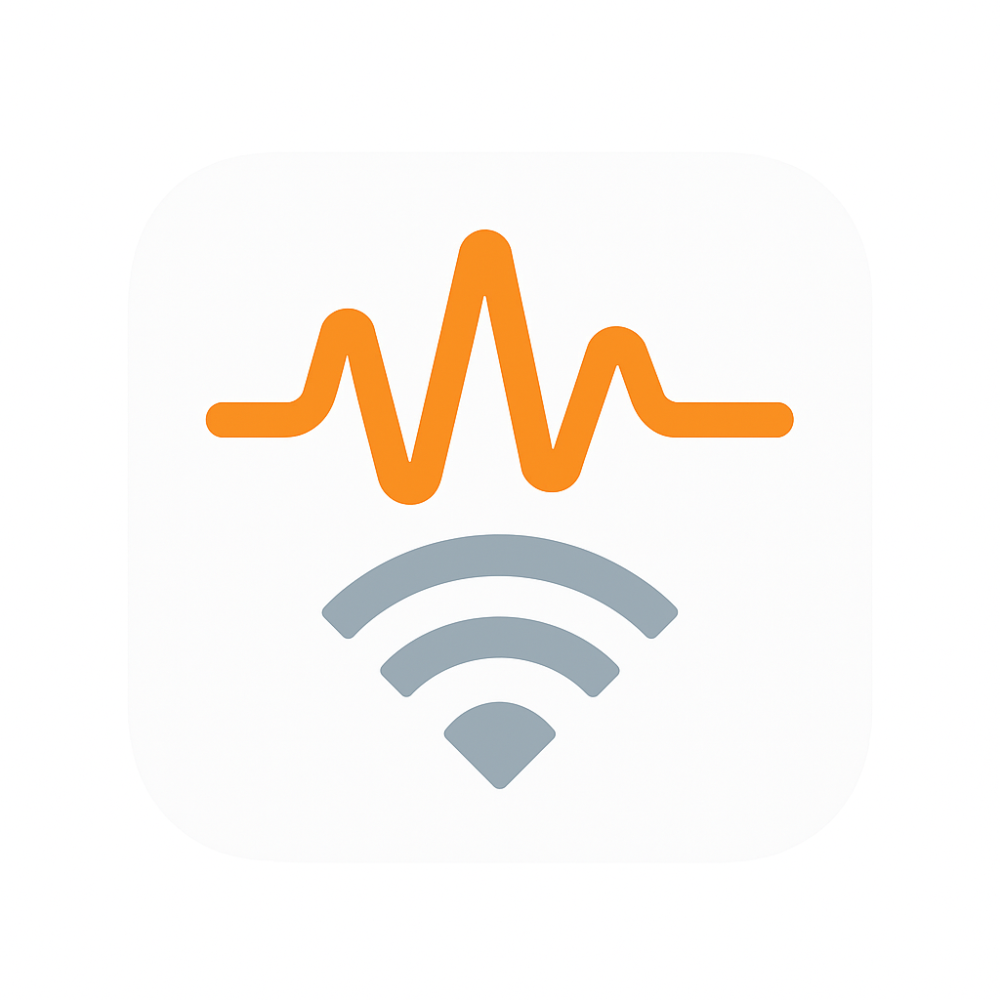

# Open NoiseNet 🔊

  

  

## The Silent Crisis: Noise Pollution is Killing Us

**Did you know that noise pollution is the second-largest environmental health risk after air pollution?** Yet unlike air quality, noise levels remain largely unmeasured, unregulated, and invisible to most communities.

### The Hidden Health Crisis

- **125 million Europeans** are exposed to harmful traffic noise levels daily
- Noise pollution causes **48,000 new cases of heart disease** annually in Europe alone
- **12,000 premature deaths** per year are linked to environmental noise
- Children in noisy environments show **impaired learning and memory development**
- Sleep disruption from noise affects **millions of people worldwide**

### The Data Desert

While we have thousands of air quality monitoring stations worldwide, **noise monitoring is virtually non-existent**:

- Most cities have **fewer than 5 noise monitoring stations** for millions of residents  
- Expensive commercial systems cost **€10,000-50,000** per unit
- Data is often **proprietary, limited, or completely unavailable** to citizens
- Communities suffering from noise pollution have **no evidence** to support policy changes

**This is where Open NoiseNet comes in.**

---

## 🌍 Our Vision: Democratizing Noise Monitoring

**Open NoiseNet** is an ambitious open-source project to create the world's first **global, citizen-powered noise monitoring network**.

### What We're Building

🔧 **Affordable Hardware**
- DIY noise monitoring devices for **€30-45** (vs €10,000+ commercial units)
- ESP32-based with MEMS microphones and weather-resistant enclosures
- Solar power options for remote deployment

📡 **Smart Software**
- Real-time sound level processing and A-weighted measurements
- Machine learning for noise source classification (traffic, construction, alarms)
- Pattern detection for recurring noise events

🗺️ **Open Data Platform**
- Global noise pollution map with real-time data
- Open data exports for researchers and policymakers  
- Community dashboards for local advocacy

⚖️ **Privacy-First Design**
- Numeric sound levels only (no audio recording by default)
- GDPR-compliant with full user control
- Optional encrypted audio snippets for classification

### The Impact

With your help, Open NoiseNet will:

✊ **Empower Communities** - Give citizens the data they need to fight noise pollution
📊 **Enable Research** - Provide scientists with unprecedented noise pollution datasets
🏛️ **Drive Policy** - Create evidence for noise regulations and urban planning
🌐 **Build Awareness** - Make the invisible problem of noise pollution visible to all

---

## 📊 Project Status & Development Progress

**Status**: 🟢 **Active Development** | **Phase**: Early MVP Development | **Progress**: Core Components Built

### 🚀 Current Implementation Status

| Component | Status | Progress | Details |
|-----------|--------|----------|---------|
| **📱 Mobile App Core** | ✅ Complete | 100% | Flutter app structure, routing, dependency injection |
| **🎤 Audio Processing** | ✅ Complete | 100% | Real-time SPL calculation, noise meter integration |
| **📡 Event Detection** | ✅ Complete | 100% | Threshold-based event detection with rolling windows |
| **💾 Local Data Storage** | ✅ Complete | 100% | SQLite with minute aggregates, 24h rolling window |
| **🎵 Audio Recording** | ✅ Complete | 100% | Circular buffer recording system (15min intervals) |
| **📈 Statistics Engine** | ✅ Complete | 100% | Hourly/daily aggregation, L10/L50/L90 percentiles |
| **🧹 Data Management** | ✅ Complete | 100% | Automatic cleanup, retention policies, health monitoring |
| **🤖 AI Analysis Queue** | ✅ Complete | 100% | Ready for local ML model integration |
| **🎨 UI/UX Design** | 🟡 In Progress | 60% | Core monitoring interface, settings screens |
| **🗺️ Location Services** | ✅ Complete | 100% | GPS integration, privacy controls |
| **🔧 Device Calibration** | ⏳ Planned | 0% | Device-specific calibration system |
| **🌐 Backend API** | ✅ Complete | 90% | FastAPI server, PostgreSQL, authentication, file uploads |
| **🖥️ Web Dashboard** | 🟡 In Progress | 30% | React frontend structure, basic components |
| **🌍 Landing Page** | ✅ Complete | 100% | Professional Next.js landing page with story integration |
| **🐳 Infrastructure** | ✅ Complete | 95% | Docker containers, Compose setup, deployment configs |
| **🔧 Device Calibration** | ⏳ Planned | 0% | Device-specific calibration system |
| **🔌 Hardware Designs** | ⏳ Planned | 0% | ESP32 firmware, PCB designs, enclosures |

### 🎯 Mobile App Progress

<strong>🟢 Completed Features (Click to expand)</strong>

#### ✅ Core Architecture
- **Flutter BLoC State Management**: Complete state management with event-driven architecture
- **Dependency Injection**: Service locator pattern with GetIt
- **Routing System**: GoRouter with deep linking support
- **Database Layer**: SQLite with comprehensive DAO pattern

#### ✅ Audio Processing System
- **Real-time SPL Monitoring**: Continuous sound pressure level calculation
- **A-weighted Measurements**: Industry-standard noise measurements
- **Noise Event Detection**: Configurable threshold-based event detection
- **Rolling Window Analysis**: 10-minute sliding window for trend analysis

#### ✅ Local Data Storage (Privacy-First)
- **Minute-level Aggregates**: L10, L50, L90 percentiles with sample counts
- **24-hour Rolling Window**: Automatic cleanup of old measurements
- **Hourly Statistics**: Automated aggregation with exceedance tracking  
- **Daily Statistics**: Peak/quiet hour identification, weekly patterns
- **Storage Optimization**: Database vacuuming, compression, health monitoring

#### ✅ Advanced Recording System
- **Circular Buffer Recording**: Max 3 recordings (45min total coverage)
- **Event-triggered Capture**: 15-minute recordings on threshold exceedance
- **File Management**: Organized storage with automatic 7-day retention
- **Privacy Controls**: Optional recording with full user control

#### ✅ AI-Ready Infrastructure
- **Analysis Queue System**: Ready for local noise classification models
- **Classification Framework**: Prepared for traffic, construction, alarm detection
- **Model Management**: Versioning and confidence scoring system
- **Background Processing**: Efficient queue management with error handling

<strong>🟡 In Progress Features</strong>

#### 🔄 User Interface
- **Monitoring Dashboard**: Real-time SPL display with visual feedback
- **Statistics Views**: Historical data visualization and trends
- **Settings Management**: Threshold configuration, privacy controls
- **Event History**: Detailed event logs with location data

#### 🔄 Data Visualization
- **Real-time Charts**: Live SPL readings with trend indicators
- **Historical Graphs**: Daily, weekly, monthly noise patterns
- **Exceedance Analysis**: WHO guideline compliance tracking
- **Export Functionality**: Data export for research and advocacy

### 📈 Recent Achievements (Current Sprint)

- ✅ **Professional Landing Page**: Complete Next.js landing page with interactive elements and story integration
- ✅ **Backend API Foundation**: FastAPI server with PostgreSQL, authentication, and file upload capabilities
- ✅ **React Frontend Structure**: Basic dashboard framework with TypeScript and component library
- ✅ **Complete Mobile App Backend**: SQLite integration, audio processing, and data management systems
- ✅ **Infrastructure Setup**: Docker containerization and deployment configuration

---

## 🚨 **JOIN THE REVOLUTION!** 

**Open NoiseNet is transforming from concept to reality - we need passionate contributors to complete the mission!**

### 👩‍💻 **Developers & Engineers Wanted**

**We've built a solid foundation - now we need your expertise to complete the ecosystem!**

**🔥 HIGH PRIORITY ROLES:**

#### **Mobile Developer** (Flutter/Dart) - *IMMEDIATE NEED*
- Complete UI/UX implementation for monitoring dashboard
- Implement data visualization charts and graphs
- Build export/sharing functionality
- **Skills**: Flutter, BLoC pattern, SQLite, Material Design

#### **Backend Developer** (Python/FastAPI) - *HIGH PRIORITY*
- Build FastAPI server with PostgreSQL + TimescaleDB
- Implement event ingestion and real-time processing
- Create user management and device registration
- **Skills**: FastAPI, PostgreSQL, TimescaleDB, Docker

#### **Frontend Developer** (React/TypeScript) - *HIGH PRIORITY*
- Build web dashboard with real-time noise mapping
- Create data visualization and analytics interface
- Implement responsive design for all devices
- **Skills**: React, TypeScript, Leaflet/Mapbox, WebSocket

#### **Firmware Engineer** (C++/ESP32) - *CRITICAL PATH*
- Develop ESP32 firmware for audio capture and SPL calculation
- Implement WiFi connectivity and data transmission
- Optimize power consumption for battery operation
- **Skills**: ESP32, Arduino IDE, I2S, WiFi, FreeRTOS

#### **ML Engineer** (Python/TensorFlow) - *GROWTH OPPORTUNITY*
- Develop local noise classification models
- Implement on-device inference for mobile app
- Create training pipeline for noise source identification
- **Skills**: TensorFlow Lite, Audio Processing, On-Device ML

#### **Hardware Engineer** - *MEDIUM PRIORITY*
- Design PCB layouts and component selection
- Create weather-resistant enclosures
- Develop solar power and battery management
- **Skills**: PCB Design, CAD, Electronics, Manufacturing

### 🤝 **Partners & Organizations**

We welcome community support for:
- **Hardware prototyping**: Components and testing equipment
- **Cloud infrastructure**: Data hosting and processing resources
- **Community building**: Hackathons, documentation, and outreach
- **Research partnerships**: University collaborations and studies

**Your support will be recognized in all project materials and you'll have direct input on the roadmap.**

### 📢 **Creators & Influencers** 

**Help us amplify this message!**

This project needs visibility to succeed. We're looking for:

- **Tech YouTubers**: Help explain the technology and problem
- **Environmental advocates**: Connect with climate and health communities  
- **Maker community**: Showcase DIY hardware builds and tutorials
- **Policy influencers**: Bridge to government and regulatory discussions
- **Social media**: Spread awareness about noise pollution impacts

**Content collaboration opportunities:**
- Hardware build videos and tutorials
- Noise pollution awareness campaigns  
- Citizen science and DIY electronics content
- Environmental justice and community advocacy
- Urban planning and smart city discussions

### 🌱 **Community Organizers**

We need people to:
- Build relationships with NGOs and environmental groups
- Organize local maker spaces and hackathons
- Create educational materials and workshops
- Coordinate with universities and research institutions
- Engage with policymakers and city planners

---

## 🗓️ **Professional Development Roadmap**

### 📋 **Current Phase: Mobile App Completion** (Q1 2025)

**Status**: 75% Complete | **Duration**: 4-6 weeks | **Team Size**: 2-3 developers

| Week | Milestone | Owner | Status |
|------|-----------|--------|---------|
| 1-2 | Complete UI/UX for monitoring dashboard | Mobile Dev | 🟡 In Progress |
| 2-3 | Implement data visualization and charts | Mobile Dev | ⏳ Planned |
| 3-4 | Add export functionality and sharing | Mobile Dev | ⏳ Planned |
| 4-5 | Beta testing and performance optimization | QA Team | ⏳ Planned |
| 5-6 | App Store submission and release | Product | ⏳ Planned |

**Deliverables**:
- ✅ Local-first mobile app with privacy controls
- ✅ Real-time SPL monitoring and event detection
- ✅ Sophisticated data storage and analytics
- 🔄 Professional UI with data visualization
- ⏳ App store release (iOS/Android)

### 🌐 **Phase 2: Backend Infrastructure** (Q2 2025)

**Duration**: 8-12 weeks | **Team Size**: 3-4 developers

| Component | Timeline | Dependencies | Priority |
|-----------|----------|--------------|----------|
| **FastAPI Server** | 3 weeks | None | 🔥 Critical |
| **PostgreSQL + TimescaleDB** | 2 weeks | FastAPI | 🔥 Critical |
| **Event Ingestion Pipeline** | 4 weeks | Database | 🔥 Critical |
| **User Management System** | 2 weeks | FastAPI | 🟡 High |
| **Device Registration API** | 2 weeks | User System | 🟡 High |
| **Real-time WebSocket API** | 3 weeks | Core API | 🟡 High |
| **Data Export APIs** | 2 weeks | Database | 🟢 Medium |

### 🖥️ **Phase 3: Web Dashboard** (Q3 2025)

**Duration**: 6-10 weeks | **Team Size**: 2-3 developers

| Feature | Timeline | Complexity | Impact |
|---------|----------|------------|--------|
| **Real-time Noise Maps** | 4 weeks | High | 🔥 Critical |
| **Analytics Dashboard** | 3 weeks | Medium | 🔥 Critical |
| **User Account Management** | 2 weeks | Low | 🟡 High |
| **Community Features** | 3 weeks | Medium | 🟡 High |
| **Data Export Interface** | 2 weeks | Low | 🟢 Medium |
| **Mobile Responsive Design** | 2 weeks | Medium | 🟡 High |

### 🔌 **Phase 4: Hardware Development** (Q4 2025)

**Duration**: 12-16 weeks | **Team Size**: 2-3 engineers

**Milestone Breakdown**:

#### **ESP32 Firmware** (6 weeks)
- Audio capture and SPL calculation (2 weeks)
- WiFi connectivity and data transmission (2 weeks)
- Power management and optimization (2 weeks)

#### **Hardware Design** (8 weeks)
- PCB design and component selection (4 weeks)
- Enclosure design and 3D printing (3 weeks)
- Weather resistance testing (1 week)

#### **Prototyping & Testing** (6 weeks)
- Initial prototype assembly (2 weeks)
- Field testing and calibration (3 weeks)
- Documentation and build guides (1 week)

### 🤖 **Phase 5: AI/ML Integration** (Q1 2026)

**Duration**: 8-12 weeks | **Team Size**: 2-3 ML engineers

- **Local Classification Models**: Traffic, construction, alarm detection
- **On-device Inference**: Mobile app integration with TensorFlow Lite
- **Training Pipeline**: Automated model updates and improvements
- **Privacy-preserving ML**: Federated learning implementation

### 🌍 **Phase 6: Global Deployment** (Q2-Q4 2026)

**Duration**: 24+ weeks | **Team Size**: 5-8 people

- **Community Partnerships**: NGO collaborations and pilot programs
- **Manufacturing Scale-up**: PCB production and assembly
- **Global Infrastructure**: Multi-region deployment
- **Policy Integration**: Government and research partnerships

---

## 📈 **Success Metrics & KPIs**

### **Technical Milestones**
- ✅ **Q4 2024**: Mobile app foundation (ACHIEVED)
- 🎯 **Q1 2025**: Mobile app MVP release
- 🎯 **Q2 2025**: Backend API operational
- 🎯 **Q3 2025**: Web dashboard launch
- 🎯 **Q4 2025**: Hardware prototypes ready
- 🎯 **Q1 2026**: Full ecosystem MVP

### **Community Goals**
- 🎯 **Q1 2025**: 500 GitHub stars, 50 contributors
- 🎯 **Q2 2025**: 1,000 beta users, 5 partner organizations  
- 🎯 **Q3 2025**: 5,000 app downloads, 100 deployed devices
- 🎯 **Q4 2025**: 10,000 users, 500 active devices
- 🎯 **Q1 2026**: 50,000 users, 2,000 devices globally

### **Impact Metrics**
- **Cities Covered**: Target 100+ cities by end of 2026
- **Data Points**: 10M+ noise measurements collected
- **Research Partnerships**: 25+ universities and NGOs
- **Policy Impact**: 10+ cities using data for regulations

---

## 🚀 **Immediate Action Items**

### 🔥 **URGENT** (Next 2 Weeks)
- [ ] **Create Project Landing Page** - Professional website with live demos
- [ ] **Complete Mobile App UI** - Finish monitoring dashboard and charts
- [ ] **Technical Documentation** - API specifications and architecture guides
- [ ] **Community Onboarding** - Contributor guidelines and development setup

### 🟡 **HIGH PRIORITY** (Next Month)
- [ ] **Backend API Development** - Start FastAPI server implementation
- [ ] **Partnership Outreach** - Contact environmental NGOs and universities
- [ ] **Funding Applications** - Apply for grants and accelerator programs
- [ ] **Content Marketing** - Create technical blog posts and demo videos  

---

## 🚀 **Get Involved Today**

### 💻 **For Developers**

#### **Quick Start**
1. 🍴 **Fork the repository** and explore our Flutter mobile app
2. 📖 **[Read CONTRIBUTING.md](./CONTRIBUTING.md)** - Development setup and guidelines  
3. 🎯 **[Check Open Issues](../../issues)** - Find tasks matching your skills
4. 💬 **[Join Discussions](../../discussions)** - Introduce yourself and ask questions
5. 🚀 **Submit your first PR** - Start with documentation or UI improvements

#### **Current Opportunities**
- **🔥 URGENT**: Mobile app UI completion (Flutter/Dart)
- **🔥 URGENT**: Backend API development (Python/FastAPI)  
- **🟡 HIGH**: Web dashboard frontend (React/TypeScript)
- **🟡 HIGH**: ESP32 firmware development (C++/Arduino)
- **🟢 MEDIUM**: Technical documentation and guides

### 🤝 **For Partners & Organizations**

#### **Partnership Opportunities**
1. **🏢 Enterprise Partners**: [Contact us](../../issues/new?template=partnership.md) for collaboration opportunities
2. **🏛️ Government Partners**: Pilot programs for smart city initiatives  
3. **🎓 Research Institutions**: Joint research and data collaboration
4. **🌱 NGO Partners**: Community deployment and advocacy support

#### **Partnership Benefits**
- **Recognition** on project website and materials
- **Collaboration** on feature development priorities
- **Early access** to APIs and research data
- **Co-development** opportunities and joint publications

### 📢 **For Content Creators & Advocates**

#### **Content Collaboration**
- **🎥 Technical Videos**: Mobile app demos, hardware builds, data analysis
- **📝 Blog Posts**: Noise pollution awareness, citizen science impact
- **🎙️ Podcasts**: Environmental health discussions, smart city topics
- **📱 Social Media**: #OpenNoiseNet campaign, community highlights

#### **Advocacy Opportunities**
- **Local Communities**: Deploy devices and organize noise monitoring campaigns
- **Policy Engagement**: Present data to city councils and environmental agencies
- **Educational Outreach**: University workshops and maker space presentations

### 🌐 **For Everyone**

#### **Immediate Actions**
- ⭐ **Star this repository** to follow development progress
- 🔔 **Watch releases** for major updates and announcements
- 🐦 **Share on social media** with #OpenNoiseNet and #NoisePollution
- 💬 **Join conversations** in GitHub Discussions
- 📧 **Tell colleagues** about environmental monitoring opportunities

---

## 📞 **Connect With Us**

### **Development Channels**
- **💻 [GitHub Issues](../../issues)**: Bug reports, feature requests, technical discussions
- **💭 [GitHub Discussions](../../discussions)**: Community conversations and Q&A
- **📚 [GitHub Wiki](../../wiki)**: Documentation, guides, and tutorials

### **Social & Communication**
- **🌐 Project Website**: *Coming Soon - Professional landing page*
- **📧 Email**: *Coming Soon - Contact and partnership inquiries*  
- **📱 Social Media**: *Coming Soon - Follow for updates and announcements*

### **Project Status Updates**
- **📊 [Project Board](../../projects)**: Real-time development progress
- **📈 [Releases](../../releases)**: Major milestones and version updates
- **📝 [Changelog](./CHANGELOG.md)**: Detailed development history

**Ready to join the fight against noise pollution?**

**Together, we're building the world's first open-source noise monitoring ecosystem! 🌍🔊**

---

## 📚 **Documentation & Resources**

### **📖 Project Documentation**
- **[📋 Product Requirements (PRD)](./prd.md)** - Complete project vision and specifications
- **[🔧 Technical Architecture](./technology.md)** - Detailed technical design and implementation
- **[👥 Contributing Guidelines](./CONTRIBUTING.md)** - How to contribute code, documentation, and ideas
- **[🛠️ Development Guide](./CLAUDE.md)** - Technical setup and development workflows

### **📊 Research & Data**
- **[📈 Data Models](./docs/data-models.md)** - Database schema and API specifications
- **[🧪 Testing Strategy](./docs/testing.md)** - Quality assurance and validation approaches
- **[🔒 Privacy Policy](./docs/privacy.md)** - Data protection and GDPR compliance
- **[⚖️ License Terms](./LICENSE)** - MIT License and usage rights

### **🎓 Educational Resources**
- **[🔊 Noise Pollution Science](./docs/science.md)** - Health impacts and measurement standards
- **[🏗️ Hardware Guides](./docs/hardware.md)** - DIY device assembly and deployment
- **[📱 Mobile App Tutorial](./docs/mobile-tutorial.md)** - Using the OpenNoiseNet app
- **[🌐 API Documentation](./docs/api.md)** - Integration guides and examples

---

### **🌟 Together, We Can Make Noise Pollution Visible**

*OpenNoiseNet is more than a project—it's a movement toward environmental justice, community empowerment, and data-driven policy change.*

**[⭐ Star](../../stargazers) • [🍴 Fork](../../forks) • [💬 Discuss](../../discussions) • [🐛 Issues](../../issues) • [🚀 Contribute](./CONTRIBUTING.md)**

---

*Active development since Q4 2024 • Mobile app 75% complete • Ready for global deployment*

